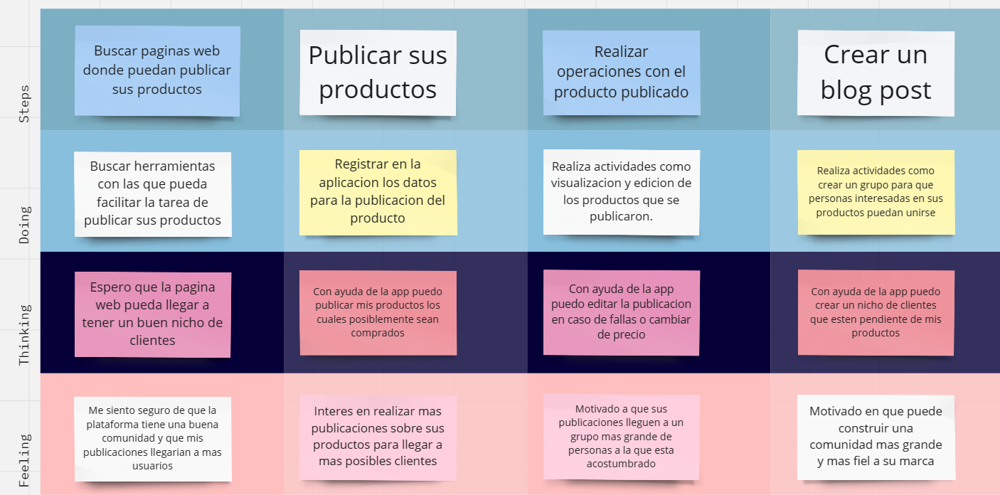
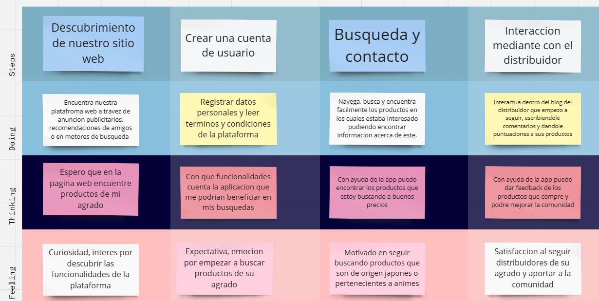
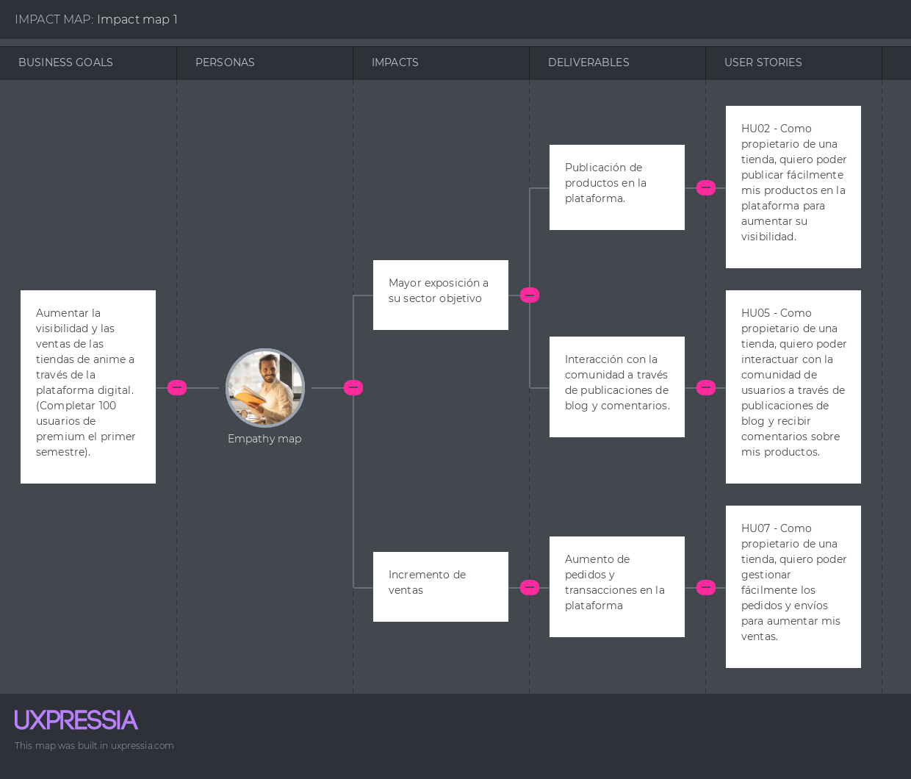
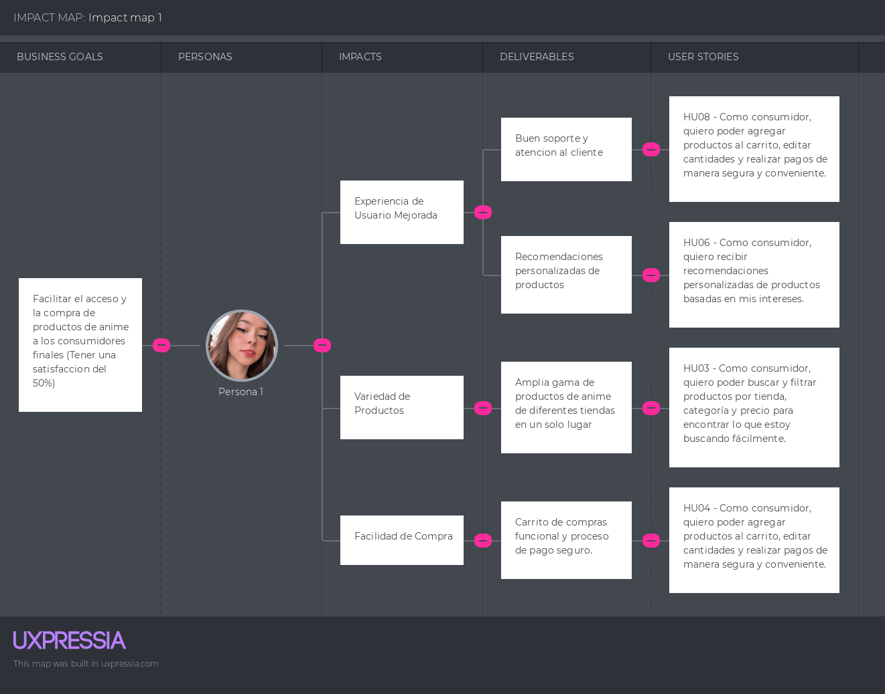

## Universidad Peruana de Ciencias Aplicadas

### Diseño de Experimentos de Ingeniería de Software

#### Sección: SW71

#### Profesor: Julio Manuel Noriega Melendez

### Informe del Trabajo Final

### Grupo 1

### Graphic Novel Hub

### Ciclo 2024-1

| Nombres y Apellidos               | Código     |
| --------------------------------- | ---------- |
| Cuya Villegas, Rafael Alberto     | u201913495 |
| Laguerre Challco, Fabrizzio Hernán| u20211a950 |
| Tasayco Vilcamiza, Damaris        | u202119605 |
| Ramos Najar, Tony Alexander       | u20211a153 |
| Zarate Castro, Jose Daniel        | u202019128 |

#### ABRIL 2024

---

# Registro de versión del informe

| Versión | Fecha      | Autor                  | Descripción de modificación                                 |
| ------- | ---------- | ---------------------- | ----------------------------------------------------------- |
| 1.0     | 01/04/2024 | Fabrizzio Laguerre     | Creación del reporte y se definió la estructura del informe |

---

# Student Outcomes

| Criterio específico                                                                                                                                                                   | Acciones Realizadas                                                                                                                                                                                                                                                                                                                                                                                                                                                                                                                                                                                                                                                                                                                                                                                                                                                                                                                                                                                                                                                                                                                                                                                                                                                                                                                                                                                                                                                                                                                                                                                                                                                                                                                                                                                                                                                                                                                                                                                                                                                                                                                                                                                                                                                                                                                                                                                                                                                                                                                                                                                                                                                                                       | Conclusiones |
| ------------------------------------------------------------------------------------------------------------------------------------------------------------------------------------- |-----------------------------------------------------------------------------------------------------------------------------------------------------------------------------------------------------------------------------------------------------------------------------------------------------------------------------------------------------------------------------------------------------------------------------------------------------------------------------------------------------------------------------------------------------------------------------------------------------------------------------------------------------------------------------------------------------------------------------------------------------------------------------------------------------------------------------------------------------------------------------------------------------------------------------------------------------------------------------------------------------------------------------------------------------------------------------------------------------------------------------------------------------------------------------------------------------------------------------------------------------------------------------------------------------------------------------------------------------------------------------------------------------------------------------------------------------------------------------------------------------------------------------------------------------------------------------------------------------------------------------------------------------------------------------------------------------------------------------------------------------------------------------------------------------------------------------------------------------------------------------------------------------------------------------------------------------------------------------------------------------------------------------------------------------------------------------------------------------------------------------------------------------------------------------------------------------------------------------------------------------------------------------------------------------------------------------------------------------------------------------------------------------------------------------------------------------------------------------------------------------------------------------------------------------------------------------------------------------------------------------------------------------------------------------------------------------------| ------------ |
| Comunica oralmente sus ideas y/o resultados con objetividad a público de diferentes especialidades y niveles jerarquicos, en el marco del desarrollo de un proyecto en ingeniería.    |                                                                                                                                                                                                                                                                                                                                                                                                                                                                                                                                                                                                                            |              |
| Comunica en forma escrita ideas y/o resultados con objetividad a público de diferentes especialidades y niveles jerarquicos, en el marco del desarrollo de un proyecto en ingeniería. |  |              |

---

# Tabla de Contenido

- [Capitulo I: Introducción](#capitulo-i-introducción)
  - [Startup Profile](#11-startup-profile)
    - [Descripción de la Startup](#111-descripción-de-la-startup)
    - [Perfiles de integrantes del equipo](#112-perfiles-de-integrantes-del-equipo)
  - [Solution Profile](#12-solution-profile)
    - [Antecedentes y Problemática](#121-antecedentes-y-problemática)
    - [Lean UX Process](#122-lean-ux-process)
    - [Lean UX Problem Statements](#1221-lean-ux-problem-statements)
    - [Lean UX Assumptions](#1222-lean-ux-assumptions)
    - [Lean UX Hypothesis Statements](#1223-lean-ux-hypothesis-statements)
    - [Lean UX Canvas](#1224-lean-ux-canvas)
  - [Segementos Objetivos](#13-segementos-objetivos)
- [Capítulo II: Requirements Elicitation & Analysis](#capítulo-ii-requirements-elicitation--analysis)
  - [Competidores](#21-competidores)
    - [Análisis Competitivo](#211-análisis-competitivo)
    - [Estrategias y tácticas frente a competidores](#212-estrategias-y-tácticas-frente-a-competidores)
  - [Entrevistas](#22-entrevistas)
    - [Diseño de entrevistas](#221-diseño-de-entrevistas)
    - [Registro de entrevistas](#222-registro-de-entrevistas)
    - [Análisis de entrevistas](#223-análisis-de-entrevistas)
  - [Needfinding](#23-needfinding)
    - [User Personas](#231-user-personas)
    - [User Task Matrix](#232-user-task-matrix)
    - [User Journey Mapping](#233-user-journey-mapping)
    - [Empathy Mapping](#234-empathy-mapping)
    - [As-Is Scenario Mapping](#235-as-is-scenario-mapping)
- [Capítulo III: Requirements Specification](#capítulo-iii-requirements-specification)
  - [To-Be Scenario Mapping](#31-to-be-scenario-mapping)
  - [User Stories](#32-user-stories)
  - [Impact Mapping](#33-impact-mapping)
  - [Product Backlog](#34-product-backlog)
- [Conclusiones](#conclusiones)
- [Bibliografía](#bibliografía)
- [Anexos](#anexos)

---

# Capitulo I: Introducción

## 1.1. Startup Profile

### 1.1.1. Descripción de la Startup

Curihub es un startup dedicado a fomentar y motivar los hábitos de lectura mediante el uso de tecnologías que facilitan el acceso, la distribución y la venta de mercancia.
En Curihub, nos visualizamos como líderes en la transformación del sector de la lectura a través de soluciones tecnológicas innovadoras y una cultura de colaboración. Queremos ser reconocidos por nuestra capacidad para crear un ecosistema de compra y venta de productos de anime inclusivo, accesible y sostenible, que inspire a las personas a disfrutar de este contenido en todo el mundo.
Nuestra misión es hacer que la adquisición de productos de anime más eficiente, segura y confable. Para lograrlo, trabajamos en estrecha colaboración con tiendas y distribuidoras para desarrollar soluciones tecnológicas innovadoras que hagan que la venta de estos productos sea más conveniente y atractiva que nunca.
Nuestra vusión es ser reconocidos como líderes globales en la distribución de productos de anime, transformando y unificando el mercado a través de la innovación tecnológica. Aspiramos a ser el puente principal entre Japón y el resto del mundo para productos de anime, creando una comunidad global donde fans, tiendas y distribuidores puedan prosperar juntos.

### 1.1.2. Perfiles de integrantes del equipo

| 
Foto
                         | Descripción                                                                                                                                                                                                                                                                                                                                                                                                                                                                                                                                                                                                                                                                                                                                                                                                            |
| ----------------------------------------------------------- | ---------------------------------------------------------------------------------------------------------------------------------------------------------------------------------------------------------------------------------------------------------------------------------------------------------------------------------------------------------------------------------------------------------------------------------------------------------------------------------------------------------------------------------------------------------------------------------------------------------------------------------------------------------------------------------------------------------------------------------------------------------------------------------------------------------------------- |
|    | Mi nombre es Tony Ramos, estoy cursando el 7mo ciclo de la carrera de Ingeniería de Software. Me considero hábil en el ámbito de la programación en los lenguajes, Python, Javascript, y últimamente estoy aprendiendo Angular. Con respeto a mi, me considero una persona responsable, con ganas de aprender y a superarme a mi mismo. |
|    | Mi nombre es Damaris Tasayco Vilcamiza. Actualmente tengo 19 años, curso el 7mo ciclo de la carrera de Ing. Software. La carrera de Ingeniería de Software me permite aprender a encontrar mejoras y soluciones a todo aquello que incluya un software dentro de su sistema. Asimismo, nos ayuda a comprender, investigar y crear nuevos mecanismos y tecnologías para dar soluciones. Finalmente mi aporte en el grupo es brindar mis conocimientos e  ideas que sean necesarias para poder hacer un trabajo eficaz.  |
|     |   Mi nombre es Rafael Alberto Cuya Villegas y tengo 22 años. Actualmente, estoy cursando la carrera de Ingeniería de Software y tengo una gran pasión por los deportes, especialmente el fútbol. Desde muy joven, me he sentido atraído por la tecnología y siempre he mostrado interés en diversos dispositivos electrónicos. Me considero una persona responsable, con habilidades para el trabajo en equipo, ya que creo firmemente que es fundamental para aprender de manera efectiva y alcanzar resultados óptimos. |
|  | Mi nombre es Fabrizzio Hernán Laguerre Challco, tengo 19 años, desde pequeño siempre he sentido un interés por aprender a usar ciertos dispositivos siendo uno de estos los más útiles que tenemos en la actualidad, las computadoras, por ello me esforzado en practicar y aprender ciertas habilidades en ofimática, edición de videos, programación y en aprender inglés, habilidades que puedo ofrecer para contribuir al grupo. |
|   |  Mi nombre es Jose Daniel Zarate Castro y actualmente tengo 20 años. Soy un estudiante de Ingeniería de Software en el quinto ciclo de mi formación académica. Soy una persona muy orientada al trabajo en equipo y siempre estoy entusiasmado por colaborar y contribuir al máximo. Me considero un participante activo en cualquier proyecto o actividad que emprenda. Tengo una actitud empática hacia los demás y me esfuerzo por entender las necesidades y perspectivas de mis compañeros. En términos de conocimientos técnicos tengo conocimientos en Java, c# y Python.
 |

## 1.2. Solution Profile

### 1.2.1. Antecedentes y Problemática

**What?** 
La empresa se especializa en la distribución de una amplia gama de productos relacionados con el anime, incluyendo mangas, peluches, figuras coleccionables, ropa y más. Ofrece una plataforma web que facilita a tiendas y distribuidores la venta y compra de estos productos de manera segura, eficiente y rápida.

**When?** 
La operación de la empresa podría haber comenzado hace unos años, adaptándose y creciendo en respuesta a la creciente popularidad del anime y la cultura pop japonesa a nivel mundial. La plataforma web está disponible 24/7, ofreciendo actualizaciones constantes de inventario y nuevos lanzamientos.

**Where?** 
Los usuarios ya sean consumidores y distribuidores podrán utilizar nuestra aplicación en cualquier dispositivo que dispongan de acceso a internet, ya que contará con diseño responsivo. Por ende, está dirigida (principalmente) a los vendedores y compradores de productos de anime.

**Who?** 
La empresa atiende a un amplio espectro de clientes, desde tiendas especializadas en productos de anime y manga hasta grandes distribuidores y minoristas online que buscan ampliar su oferta de productos. También atrae a consumidores finales apasionados por el anime y la cultura pop japonesa.

**Why?** 
La empresa fue creada para solucionar varios desafíos en la industria del anime y manga, como la dificultad de acceso a un catálogo diverso y auténtico de productos fuera de Japón, la necesidad de una distribución más eficiente y segura, y la demanda de servicios personalizados para tiendas y distribuidores.

**How?** 
Mediante el desarrollo de una plataforma web intuitiva y segura, la empresa facilita el proceso de pedido, venta y distribución de productos de anime. La plataforma incluye funciones como gestión de inventario, procesamiento de pedidos en tiempo real, seguimiento de envíos, y soporte al cliente. La empresa asegura la autenticidad y calidad de los productos a través de asociaciones directas con proveedores y fabricantes en Japón.

**How much?** 
Los costos para los usuarios de la plataforma pueden variar. Podría incluir una tarifa de suscripción mensual o anual para los vendedores, además de una comisión sobre las ventas realizadas. Para los compradores, los precios de los productos estarían competitivamente establecidos, y los costos de envío se calculan en función del destino y el tamaño del pedido.

**Antecedentes:** 
La proliferación del anime y la cultura pop japonesa ha visto un aumento en la demanda mundial de productos relacionados. Sin embargo, muchas tiendas y distribuidores fuera de Japón enfrentan dificultades para acceder a un mercado diverso y obtener productos auténticos de manera eficiente y rentable. Además, la falsificación y la variabilidad en la calidad de los productos son problemas constantes en el mercado.

**Problemática a resolver:** 
Acceso limitado a productos auténticos y variados de anime fuera de Japón, ineficiencias en la cadena de suministro y distribución para tiendas y distribuidores internacionales.
Falta de una plataforma centralizada que ofrezca seguridad, eficiencia y rapidez en la transacción y distribución de productos de anime y la necesidad de un control de calidad confiable para combatir la proliferación de productos falsificados.

### 1.2.2. Lean UX Process

#### 1.2.2.1. Lean UX Problem Statements

**Problem Statement #1: Tiendas y distribuidoras de anime** 
En el dinámico mercado del anime y el manga, los dueños de tiendas y distribuidoras enfrentan múltiples desafíos para satisfacer la creciente demanda de productos auténticos y variados. Estos desafíos incluyen dificultades para acceder a un inventario amplio y diversificado, la gestión ineficiente de la cadena de suministro, y la constante amenaza de productos falsificados, lo que resulta en una experiencia de compra decepcionante para los consumidores finales y afecta la reputación de los vendedores. A esto se suma la complejidad de gestionar múltiples relaciones con proveedores y la presión de mantener una logística eficiente y coste-efectiva en un entorno de comercio electrónico globalizado. Estos problemas no solo limitan la capacidad de las tiendas y distribuidoras para expandir su alcance y mejorar su rentabilidad, sino que también comprometen su habilidad para proporcionar a los aficionados del anime acceso rápido y seguro a los productos que aman, obstaculizando el crecimiento general del mercado de anime y manga fuera de Japón. 
**¿Cómo atraer más clientes a las tiendas y distruibuidoras de anime haciendo uso de las nuevas tecnologías e innovaciones que existen en el mercado actual?**

**Problem Statement #2: Consumidores de contenido** 
Las personas que buscan consumir productos de anime a menudo se enfrentan a la difícil realidad de no tener acceso fácil al contenido a través de medios digitales. Además, en algunos casos no logran encontrar legalmente el contenido deseado, lo que las lleva a recurrir a distribuidores informales los cuáles no siempre ofrecen productos originales, lo que afecta directamente a los distribuidores formales.
De este modo, se detectó como factor crítico la falta de acceso fácil y legal a los productos a través de medios digitales que permitan a los consumidores seguir comprando productos que ellos consumen sin tener que recurrir a prácticas no éticas que perjudican la industria. 
**¿Cómo se puede aprovechar al máximo las nuevas tecnologías y herramientas disponibles en la actualidad para brindar facilidades para adquirir y adquirir estos productos que mejoren su experiencia en general?**

#### 1.2.2.2. Lean UX Assumptions

**Business Assumptions:** 
Creo que mis clientes necesitan acceder a una amplia variedad de mangas y productos de anime de manera conveniente y atractiva en la era digital. Estas necesidades se pueden resolver con una plataforma digital que facilite el acceso, distribución y publicación de contenidos de mangas y productos de anime. Mis clientes iniciales serán los amantes de los mangas y tiendas pequeñas que buscan llegar a un mercado más amplio a través de mi plataforma. El valor #1 que un cliente quiere obtener de mi servicio es acceso conveniente a una amplia variedad de contenido relevante y de calidad. El cliente también puede obtener beneficios adicionales como personalización del contenido, recomendaciones basadas en intereses individuales, y descuentos en forma de "bundles".  

El valor #1 que un cliente requiere de mi servicio es que puedan acceder al catálogo de productos de las tiendas y distruibuidoras de forma eficiente y segura, además de que les permita realizar las operaciones de compra y venta. 

El cliente también puede obtener estos beneficios adicionales: ahorrar tiempo en realizar el proceso de publicación de productos (al contar con una herramienta que lo gestiona de una manera más automatizada), una mejor experiencia por parte de los consumidores (al contar con una amplia variedad de contenido centralizado en una aplicación que le fomente a seguir comprando) y una mayor facilidad para realizar pagos por sus productos.

Voy a adquirir a mis clientes a través de publicidad en redes sociales como YouTube y Google Ads para alcanzar a los productores y consumidores de productos anime. Asimismo, buscaremos fidelizar a nuestros clientes para que empiecen a realizar marketing de boca a boca.

Haré dinero a través una tarifa de suscripción mensual o anual para los vendedores, además de una comisión sobre las ventas realizadas. Para los compradores, los precios de los productos estarían competitivamente establecidos, y los costos de envío se calculan en función del destino y el tamaño del pedido.

Mi competencia en el mercado serán las empresas ya establecidas que ofrezcan servicio de plataforma de comercio electrónico specializadas en productos de anime u otros.

Los venceremos debido a que brindaremos una experiencia de software que cumple con lo requerido para que sea una aplicación completa en su rubro y sea amigable con los dos usuarios que interactúan con ella.

Mis mayores riesgos de producto son fallas en el sistema de la aplicación web y que el cliente no lo considere una alternativa adecuada a sus necesidades.

Resolveremos esto a través de un buen proceso de desarrollo, apoyado en el diseño previo de la aplicación; así como la realización de entrevistas para conocer más a fondo la situación actual, que es lo que espera el usuario y que tan cómodo se encuentra con la propuesta que planteamos.

Sabremos que hemos tenido éxito cuando veamos uno de estos cambios en el comportamiento de nuestro cliente:

- Mayor satisfacción al saber que puede acceder fácilmente a una amplia variedad de clientes para realizar ventas.
- Motivación al saber que sus productos están siendo publicados en una plataforma que fomenta y brinda recomendaciones a clientes según sus gustos y preferencias.

**¿Qué otras suposiciones tenemos que, de probarse falsas, pueden causar que nuestro proyecto fracase?** 

- Los consumidores buscan utilizar medios más actuales para adquirir y consumir productos de anime.
- Los dueños de tiendas o distribuidoras no se sienten cómodos con los medios tradicionales de publicación. Asimismo, esperan en algún momento recibir un aumento de ventas y clientela.

**User Assumptions** 
**¿Quién es el usuario?**

- Las tiendas especializadas en productos de anime y manga hasta grandes distribuidores y minoristas online que buscan ampliar su oferta de productos.
- Consumidores finales apasionados por el anime y la cultura pop japonesa.

**¿Dónde encaja nuestro producto? ¿En su trabajo o en su vida?** 
En el caso de los consumidores, la utilización de la plataforma se da cuándo están buscando realizar una actividad de ocio. Por ende, el producto será utilizado en su vida cotidiana.

En el caso de los autores, el uso de la plataforma se da cuándo estan buscando aumentar sus ventas dentro de su trabajo. No obstante, para fines prácticos, se considerará que nuestro producto será utilizado en el desarrollo de sus actividades de trabajo.

**¿Qué problemas tiene nuestro producto y cómo se pueden resolver?** 
Problemas:

- Que la herramienta no resulte atractiva para los consumidores y distribuidores, ya que sin ambas partes no se podría generar suficiente contenido y monetización para mantener el negocio en funcionamiento.
- Que los consumidores no encuentren interesante nuestra propuesta y prefieran conservar o mantener la forma en la que consumían contenido hasta el momento.
  Solución:
- Realizar un buen diseño de entrevistas para que esta sea realizada de la mejor manera posible y entender qué es lo que espera encontrar los dos tipos de usuario y cómo debería ser su experiencia de usuario al emplear la aplicación.
- Obtener información de la competencia y analizarla para establecer un estándar de qué características necesitamos desarrollar para nuestro producto.

**¿Cuándo y cómo es usado nuestro producto?** 
Nuestro producto de software será utilizado cuando el distribuidor decida publicar su catálogo de productes y busque aumentar su npumero de ventas y clientes.

También, cuando el lector decida acceder a consumir diversas obras publicadas en una misma plataforma.

Finalmente, nuestro producto será utilizado por medio de una aplicación web que cuente con diseño responsivo y les permita a nuestros usuarios desarrollar cómodamente todas las operaciones que requiera independientemente del tamaño de la pantalla de su dispositivo.

**¿Qué características son importantes?**

- Realizar operaciones de creación, visualización y edición de los productos que el distribuidor publique.
- Permitir a las distribuidoras crear blog post para que puedan recibir comentarios, peticiones y calificaciones a sus productos por parte de los usuarios.
- Facilitar al consumidor la búsqueda de productos según la tienda, categoría y precio de este.

**¿Cómo debe verse y comportarse nuestro producto?**

- La interfaz de usuario (UI) de nuestra aplicación debe de ser moderna, llamativa y coherente con nuestro rubro de lectura.
- La experiencia de usuario (UX) de nuestra aplicación debe de priorizar la navegación sencilla e intuitiva a través de los diferentes apartados de la aplicación.
- El servicio debe de estar disponible en todo momento (24/7).

#### 1.2.2.3. Lean UX Hypothesis Statements

**Creemos que** sí ofrecemos una plataforma para la publicación de productos como mangas y novelas ligeras asiáticas (principalmente), aumentará el interés del público en estas formas de entretenimiento. **Sabremos que** estamos en lo cierto **cuando** se observa un aumento en el número de usuarios que visitan y utilizan nuestro sitio web regularmente.

**Creemos que**, si permitimos que las tiendas publiquen sus productos en nuestro sitio web, aumentará la diversidad de contenido y atraerá a una audiencia más amplia. **Sabremos que** estamos en lo cierto **cuando** recibamos comentarios positivos de compras satisfactorias, indicando que nuestro sitio web ha sido útil para adquirir sus productos y obtener ventas.

**Creemos que**, si proporcionamos herramientas y recursos por medio de blog posts para que los compradores puedan comentar y calificar productos o tiendas, podrán mejorar su imagen de las tiendas y dar mayor seguridad al comprar. **Sabremos que** estamos en lo cierto **cuando** veamos un aumento en la cantidad y calidad de productos publicadas en nuestro sitio web.

**Creemos que** sí ofrecemos una experiencia de usuario fácil de usar y una interfaz de alta calidad, los consumidores estarán más inclinados a usar nuestro sitio web como su fuente principal para adquirir mangas, peluchas y mercancia de sus animes favoritos. **Sabremos que** estamos en lo cierto **cuando** las tiendas que publicaron sus productos en nuestro sitio web comienzan a ser recibir mayores reseñas y compras.

#### 1.2.2.4. Lean UX Canvas

## 1.3. Segmentos Objetivos

**Distribuidores de anime:** Personas, tiendas o distribuidoras que se dediquen a la produccion y venta de estos productos.

**Consumidores de contenido:** Personas que disfrutan de leer mangas o comprar productos de sus animes y buscan una plataforma en línea para adquirir estos de forma rápida, sencilla y segura.

# Capítulo II: Requirements Elicitation & Analysis

## 2.1. Competidores

- **Crunchyroll**: Es el destino principal para los aficionados al anime y el manga, ofreciendo una vasta biblioteca de series animadas, películas y mangas. Con más de 1000 títulos disponibles, se presenta como el líder global en streaming de anime, ofreciendo contenido tanto clásico como estrenos simultáneos con Japón en más de 200 países. La plataforma no solo se limita al streaming de video, sino que también proporciona acceso a una selección de mangas digitales, convirtiéndose en un sitio integral para los fanáticos del género. Su interfaz es intuitiva, permitiendo a los usuarios navegar fácilmente entre categorías de género, temporadas, y popularidad, además de contar con opciones de membresía gratuita con anuncios o premium sin anuncios y con acceso a estrenos.
- **ComiXology**: Se posiciona como una cadena de tiendas líder en la distribución de productos culturales y electrónicos, originaria de Francia pero con presencia en varios países europeos y en otros continentes. Su catálogo incluye libros, cómics, mangas, música, películas, videojuegos, hardware y productos tecnológicos. Reconocida por su compromiso con la cultura, Fnac organiza regularmente eventos, firmas de libros y conciertos, fomentando un fuerte sentido de comunidad entre sus clientes. La experiencia de compra en Fnac es ampliamente valorada por los consumidores debido a su enfoque experto y personalizado, ofreciendo no solo productos sino también asesoramiento y recomendaciones. La tienda en línea de Fnac complementa sus locales físicos, proporcionando una experiencia de compra cómoda y accesible desde cualquier lugar.
- **Fnac**: Es una plataforma digital líder en la distribución de cómics, novelas gráficas y mangas, ofreciendo un catálogo extenso que abarca desde los grandes editores como Marvel, DC Comics, Image, y más, hasta editoriales independientes. Fundada en 2007 y adquirida por Amazon en 2014, Comixology ha revolucionado la manera en que los aficionados leen cómics, introduciendo el innovador sistema de lectura Guided View, que optimiza la experiencia de lectura en dispositivos móviles y tabletas. Con una interfaz amigable y una función de búsqueda eficiente, los usuarios pueden explorar fácilmente por género, editor, o popularidad. Además, Comixology ofrece una opción de suscripción, Comixology Unlimited, que brinda acceso ilimitado a una vasta selección de títulos por una tarifa mensual, haciendo de ella una plataforma atractiva tanto para nuevos lectores como para coleccionistas veteranos.

### 2.1.1. Análisis Competitivo

### 2.1.2. Estrategias y tácticas frente a competidores

- 
- 
- 
- 
- 

## 2.2. Entrevistas

### 2.2.1. Diseño de entrevistas

**:**

Preguntas introductorias:

- ¿Cuál es su nombre completo y cuántos años tiene? Además, ¿en qué distrito se encuentra actualmente?
- ¿A qué se dedica actualmente?
- 
- 
- 

Preguntas principales:

- 
- 

**Para Consumidores de contenido:**

Preguntas introductorias:

- ¿Cuál es su nombre completo y cuántos años tiene? Además, ¿en qué distrito se encuentra actualmente?
- ¿A qué se dedica actualmente?
- ¿Cuáles son los dispositivos que utiliza principalmente?
- ¿Eres apasionado por la lectura?
- ¿Que es lo que te gusta leer (Libros, historietas, cómics, mangas)?
  
Preguntas principales:

- ¿Qué géneros de manga prefieres y por qué?
- ¿Sigues a autores específicos? ¿Cuáles son tus favoritos?
- ¿Prefieres comprar mangas en formato físico o digital? ¿Por qué?
- ¿Alguna vez tuviste alguna dificultad para adquirir un manga en formato físico?
- ¿También compras mercancia de tus mangas preferidos?
- ¿Cómo decides qué manga comprar? ¿Qué factores influyen en tu decisión?
- ¿Qué esperas de una tienda de mangas, ya sea en línea o física?

### 2.2.2. Registro de entrevistas

_Tienda_

Nombre: 

Edad: 

Distrito: 

Nombre completo: 

Edad: 

Distrito: 

_Lector_

Nombre completo: Anapaula Diaz

Edad: 21 años

Distrito: Cercado de lima

[Ver entrevista](https://youtu.be/1VlRfYxsuVA)

Nombre completo: Eduardo Arenas

Edad: 22 años

Distrito: Cercado de lima

[Ver entrevista](https://youtu.be/f3VZy_-7u8k)

Nombre completo: 

Edad: 

Distrito: 

### 2.2.3. Análisis de entrevistas

- Consumidores de contenido:

Hemos realizado entrevistas a los consumidores de contenido para recopilar información sobre sus experiencias previas al intentar comprar mangas, así como sus gustos y preferencias entre los mangas y sus autores. Durante este proceso, hemos identificado una serie de dificultades que enfrentan al comprar mangas. En primer lugar, hemos observado que existe una escasez de tiendas y una limitada variedad de opciones disponibles. Además, se ha destacado una preferencia general por el formato digital sobre el físico entre los consumidores encuestados. También hemos registrado problemas recurrentes durante el proceso de compra, lo que indica una experiencia insatisfactoria para muchos consumidores. Por último, hemos notado que el género del manga influye significativamente en las decisiones de compra de los consumidores de contenido.

- Escritores:

## 2.3. Needfinding

### 2.3.1. User Personas

### 2.3.2. User Task Matrix

_Escritores_

_Consumidores de contenido_

### 2.3.3 User Journey Mapping

_Escritores_

_Consumidores de contenido_

### 2.3.4. Empathy Mapping

_Escritores_

_Consumidores de contenido_

### 2.3.5 As-Is Scenario Mapping

_Escritores_

_Consumidores de contenido_

# Capítulo III: Requirements Specification

## 3.1. To-Be Scenario Mapping

Distribuidores de contenido

Lector de contenido

## 3.2. User Stories

|**Epic/Story**|**Título**|**Descripción**|**Criterios de Aceptación**|**Relacionado con (Epic ID)**|
| :-: | :-: | :-: | :-: | :-: |
| EPIC-001        | Plataforma de Comercio Electrónico para Anime y Manga | Como propietario de una tienda de anime, quiero tener una plataforma digital que me permita publicar y vender mi inventario de manera eficiente para llegar a un mercado más amplio y aumentar mis ventas. | - La plataforma permite a los propietarios de tiendas registrar sus cuentas.   - Los propietarios de tiendas pueden cargar y gestionar su inventario de productos.   - Los usuarios pueden buscar y comprar productos fácilmente. | -                        |
| EPIC-002        | Experiencia de Usuario Enriquecida     | Como usuario final apasionado por el anime, quiero una experiencia de usuario en la plataforma que sea atractiva y fácil de usar, con funciones como recomendaciones personalizadas y una navegación intuitiva. | - La plataforma presenta una interfaz de usuario atractiva y fácil de navegar.   - Los usuarios reciben recomendaciones personalizadas según sus preferencias. | -                        |
| HU-01           | Registro y Creación de Perfil           | Como usuario de la plataforma, quiero poder registrarme y crear un perfil para acceder a todas las funcionalidades, como buscar y comprar productos.                           | - Los usuarios pueden registrarse en la plataforma proporcionando información básica.   - Los usuarios pueden crear y editar sus perfiles. | EPIC-001                 |
| HU-02           | Publicación de Productos                | Como propietario de una tienda, quiero poder publicar mis productos en la plataforma de manera fácil y rápida, incluyendo imágenes, descripciones y precios.                   | - Los propietarios de tiendas pueden agregar nuevos productos con imágenes, descripciones y precios. | EPIC-001                 |
| HU-03           | Búsqueda y Filtros de Productos         | Como consumidor, quiero poder buscar y filtrar productos por tienda, categoría y precio para encontrar rápidamente lo que estoy buscando.                                         | - Los usuarios pueden buscar productos por tienda, categoría y precio.   - Los usuarios pueden aplicar filtros para refinar los resultados de búsqueda. | EPIC-001                 |
| HU-04           | Gestión de Carrito de Compras           | Como usuario, quiero poder agregar productos a mi carrito de compras, editar la cantidad y proceder al pago de manera segura y confiable.                                           | - Los usuarios pueden agregar productos al carrito de compras y editar la cantidad.   - Los usuarios pueden proceder al pago de forma segura. | EPIC-001                 |
| HU-05           | Interacción con la Comunidad            | Como propietario de una tienda, quiero poder interactuar con los clientes a través de publicaciones de blog, recibir comentarios y calificaciones para mejorar mis productos y servicios. | - Los propietarios de tiendas pueden publicar entradas de blog y recibir comentarios.   - Los usuarios pueden dejar comentarios y calificaciones en los productos. | EPIC-001                 |
| HU-06           | Personalización de Contenido           | Como usuario, quiero recibir recomendaciones personalizadas de productos basadas en mis intereses y compras anteriores para descubrir nuevas obras de anime y manga.                | - Los usuarios reciben recomendaciones personalizadas según sus intereses y compras anteriores. | EPIC-002                 |
| HU-07           | Gestión de Pedidos y Envíos            | Como propietario de una tienda, quiero poder gestionar fácilmente los pedidos recibidos, procesarlos y coordinar los envíos de manera eficiente para garantizar una experiencia de compra satisfactoria para mis clientes. | - Los propietarios de tiendas pueden ver y gestionar los pedidos recibidos.   - Los propietarios de tiendas pueden coordinar los envíos de manera eficiente. | EPIC-001                 |
| HU-08           | Soporte y Atención al Cliente          | Como usuario, quiero contar con un servicio de atención al cliente accesible y receptivo que resuelva mis dudas, problemas o reclamos de manera oportuna y efectiva.                | - Los usuarios pueden acceder a un servicio de atención al cliente a través de diferentes canales (chat en vivo, correo electrónico, etc.).   - El servicio de atención al cliente responde a las consultas de manera oportuna y efectiva. | EPIC-002                 |

## 3.3. Impact Mapping

Distribuidores de contenido

Lector de contenido

## 3.4. Product Backlog

|**#Orden**|**User Story Id**|**Título**|**Descripción**|**Story Points (1 / 2 / 3 / 5 / 8)**|
|----------|-----------------|----------|---------------|---------------------------------------|
|   1      |    HU-01        | Registro y Creación de Perfil | Como usuario de la plataforma, quiero poder registrarme y crear un perfil para acceder a todas las funcionalidades, como buscar y comprar productos. | 3 |
|   2      |    HU-02        | Publicación de Productos | Como propietario de una tienda, quiero poder publicar mis productos en la plataforma de manera fácil y rápida, incluyendo imágenes, descripciones y precios. | 8 |
|   3      |    HU-03        | Búsqueda y Filtros de Productos | Como consumidor, quiero poder buscar y filtrar productos por tienda, categoría y precio para encontrar rápidamente lo que estoy buscando. | 5 |
|   4      |    HU-04        | Gestión de Carrito de Compras | Como usuario, quiero poder agregar productos a mi carrito de compras, editar la cantidad y proceder al pago de manera segura y confiable. | 5 |
|   5      |    HU-05        | Interacción con la Comunidad | Como propietario de una tienda, quiero poder interactuar con los clientes a través de publicaciones de blog, recibir comentarios y calificaciones para mejorar mis productos y servicios. | 3 |
|   6      |    HU-06        | Personalización de Contenido | Como usuario, quiero recibir recomendaciones personalizadas de productos basadas en mis intereses y compras anteriores para descubrir nuevas obras de anime y manga. | 5 |
|   7      |    HU-07        | Gestión de Pedidos y Envíos | Como propietario de una tienda, quiero poder gestionar fácilmente los pedidos recibidos, procesarlos y coordinar los envíos de manera eficiente para garantizar una experiencia de compra satisfactoria para mis clientes. | 8 |
|   8      |    HU-08        | Soporte y Atención al Cliente | Como usuario, quiero contar con un servicio de atención al cliente accesible y receptivo que resuelva mis dudas, problemas o reclamos de manera oportuna y efectiva. | 3 |

# Capítulo IV: Product Design

## 4.1. Style Guidelines

### 4.1.1. General Style Guidelines

Para el branding que utilizaremos para nuestro servicio (Curihub), será el siguiente modelo:

#### Typography

Se optó por utilizar la tipografía "Inter", debido a que es simple, fácil de leer y está diseñada para ayudar con la legibilidad de letras minúsculas y mayúsculas para el lector. (Google fonts, s.f.).

#### Colors

Brand Colors:

Para el resto de colores de los aspectos básicos de la aplicación, se utilizará la siguiente paleta de colores:

#### Spacing

Para el uso de espaciado en nuestra aplicación, usaremos multiplos de 8 en un rango amplio para poder tener a nuestra disposición distintos tamaños para los elementos según sea requerido.

#### Tono de Comunicación y Lenguaje Aplicado

Al tener como segmento objetivo a jóvenes (en su mayoría) y adultos lectores y/o escritores de fanfics, en un rango de entre 18 y 40 años, hemos optado por utilizar un tono divertido, casual, respetuoso y sereno para que estos puedan sentir que están en una aplicación juvenil, remarcando la energía y emoción al momento de leer sus historias favoritas.

### 4.1.2. Web Style Guidelines

Uno de los aspectos más importantes en el desarrollo web es el uso correcto del responsive design para que la aplicación se visualice perfectamente sin importar el tamaño de la pantalla o dispositivo.

Por esta razón, se decidió realizar el desarrollo de nuestra solución tomando en cuenta los siguientes breakpoints para que el responsive design se muestre correctamente:

| Breakpoint prefix | Minimum width |
|:-----------------:|:-------------:|
| sm                | 640px         |
| Md                | 768px         |
| L                 | 1024px        |
| xl                | 1280px        |
| 2xl               | 1536px        |

Con respecto a los estándares visuales, se utilizarán los mismos elementos presentados en la sección anterior para lograr uniformidad en todo el uso de nuestra aplicación. Igualmente, las medidas y propiedades presentadas son escalables, manejables y compatibles con el desarrollo de responsive design.

### 4.1.3. Mobile Style Guidelines

#### 4.1.3.1. iOS Mobile Style Guidelines

#### 4.1.3.2. Android Mobile Style Guidelines

## 4.2. Information Architecture

### 4.2.1. Organization Systems

El área de diseño de nuestra startup decidió enfocarse principalmente en la facilidad o satisfacción que el usuario tendrá al usar nuestra aplicación. Todos los elementos de diseño que hemos utilizado como las paletas de colores, imágenes e íconos, han seguido una tendencia minimalista con el fin de no exponer a los usuarios con tanta información.

En el caso del landing page de nuestra aplicación nos hemos basado en el sistema de organización jerárquica (o “Visual hierarchy”, en inglés). La razón de esta elección es debido al impacto positivo que una página bien distribuida según tamaños, espacios y colores brinda al usuario. Por ejemplo, en la primera vista del landing page se añadirán elementos de tamaños grandes y con colores únicos (como el botón call to action), para captar la atención del visitante. Asimismo, mientras se hace scroll down por la página los tamaños se verán reducidos.

Por otro lado, cuando el usuario entre a la aplicación web en sí, utilizaremos un sistema de organización matricial (en inglés, “Matrix”). Este sistema, a diferencia del jerárquico, es un poco más complejo para el usuario porque está diseñado para que el usuario tome el control de su navegación (tubik, 2017). Sin embargo, al ser una aplicación basada en la lectura y/o escritura fanfics, es necesario dividir las secciones de esta manera para que se pueda tener mejor organizado lo que ofrecemos.

En nuestra aplicación se aplican los cuatro esquemas de categorización de contenido, mediante un sistema de filtros para buscar contenido. Se podrá rotar entre el Alphabetical, Chronological, Topic y Audience schemes.

### 4.2.2. Labeling Systems

Será realizado de tal forma que las palabras utilizadas sean simples y fáciles de entender. Las etiquetas en la aplicación tendrán un máximo de cuatro palabras.

Esto se verá reflejado cuando hagamos la presentación del landing page y web application, de manera que sea más sencillo entender este concepto y cómo buscamos realizarlo.

### 4.2.3. SEO Tags and Meta Tags

Title: Curihub

Description: Registrate y descubre las mejores historias de tus personajes favoritos. ¡ Adéntrate en Curihub !

Keywords: Fanfic, Fanfiction, Lectura, Novelas, Escritura.

Author: Curihub

### 4.2.4. Searching Systems

Se optó por implementar una interfaz que resalte los botones e información principal para llamar la atención de los usuarios más emocionales e invitarlos a entrar en nuestra aplicación. Sin embargo, para los usuarios racionales, se ha brindado información más detallada para que puedan tomar la decisión de utilizar nuestro producto.

Es por estas razones que disponemos de los botones “call to action” que permiten llevar al usuario al registro para empezar a hacer uso de la aplicación. Se han posicionado al inicio y al final del landing page.

Con respecto a la aplicación, vamos a resaltar los subtítulos más importantes que dividen las funcionalidades de esta, para que a los usuarios se les facilite encontrar lo que buscan.

### 4.2.5. Navigation Systems

Se buscará priorizar fluidez a través de todo el contenido de nuestra landing page y aplicación web, con la capacidad de encontrar toda la información necesaria.

De esta manera, el usuario no se sentirá frustrado o confundido por una mala organización de la información.

En consecuencia, todo el diseño trabajado para nuestro proyecto, será enfocado en cumplir estas reglas establecidas.

## 4.3. Landing Page UI Design

### 4.3.1. Landing Page Wireframe

### 4.3.2. Landing Page Mock-up

## 4.4. Mobile Applications UX/UI Design

### 4.4.1. Mobile Applications Wireframes

### 4.4.2. Mobile Applications Wireflow Diagrams

### 4.4.3. Mobile Applications Mock-ups

### 4.4.4. Mobile Applications User Flow Diagrams

## 4.5. Mobile Applications Prototyping

### 4.5.1. Android Mobile Applications Prototyping

### 4.5.2. iOS Mobile Applications Prototyping

## 4.6. Web Applications UX/UI Design

### 4.6.1. Web Applications Wireframes

### 4.6.2. Web Applications Wireflow Diagrams

### 4.6.3. Web Applications Mock-ups

### 4.6.4. Web Applications User Flow Diagrams

## 4.7. Web Applications Prototyping

## 4.8. Domain-Driven Software Architecture

Para esta sección hemos empleado los principios de Domain-Driven Design (DDD) en conjunto con el modelo de visualización de la arquitectura de software C4 (Context, container, components and code).

#### Herramientas del domain-driven design:

A continuación, se muestran los principales ejemplos del uso de las herramientas de DDD aplicados a nuestro dominio, tales como el Storytelling, Event Storming, Domain message flow modeling y Bounded context canvas.

#### Storytelling:

##### Publishing a literary product:

##### Looking for a literary product:

##### Reading a literary product

#### Event Storming:

##### Leyenda:

  

##### Publicación de productos literarios:

  

##### Visualización de productos literarios:

  

##### Lectura de productos literarios:

  

#### Domain Message Flow Modeling:

##### Elementos:

  

##### Escenario:

Publicación de un producto literario nuevo

  

#### Bounded Context Canvas:

##### Leyenda de colaboradores:

  

##### Publicación de un producto literario:

  

En esta sección se especifican los Ubiquitous Language para cada subdominio del negocio. Sin embargo, no es necesario especificarlo para todos ya que el negocio no presenta términos complejos, sino palabras claves conocidas por todos los involucrados.

### 4.8.1. Software Architecture Context Diagram

Este diagrama corresponde al diagrama de contextos del modelo C4. En él se detalla los principales usuarios, nuestro sistema y los sistemas externos que emplearemos. Asimismo, se muestra la relación entre cada elemento.

  

#### Landscape Diagram:

  

### 4.8.2. Software Architecture Container Diagrams

Este diagrama corresponde al diagrama de contenedores del modelo C4. Aquí se especifican los contenedores y bounded context que conforman nuestro sistema Read-R, tomando elementos como el Landing, el Api Rest, la base de datos, etc. Y detalla en qué contexto están relacionados los sistemas externos con nuestro sistema de software.

  

### 4.8.3. Software Architecture Components Diagrams

Estos diagramas corresponden a los diagramas de componentes del modelo C4. Aquí se detalla mucho más cada bounded context que conforma nuestro software Read-R, mostrando sus componentes y la relación entre ellos.

#### Account Context:

  

#### Visualization Context:

  

#### Publishing Context:

  

#### Reading Context:

  

#### Payment Context:

  

## 4.9. Software Object-Oriented Design

### 4.9.1. Class Diagrams

  

### 4.9.2. Class Dictionary

|          Plan         |                                                                |
|:---------------------:|:--------------------------------------------------------------:|
| Atributo              | Descripción                                                    |
| - name: String        | El nombre que recibe el plan (ej. Entry Readr o Expert Readr). |
| - description: String | La descripción sobre el plan elaborado                         |

|        PlanPrice       |                                                                                                                                                 |
|:----------------------:|:-----------------------------------------------------------------------------------------------------------------------------------------------:|
| Atributo               | Descripción                                                                                                                                     |
| - frequency: Frequency | Un objeto de la clase Frequency que encapsula la lógica que abarca la frecuencia en la que es vigente el Plan.                                  |
| - price: Money         | Un objeto de la clase Price que encapsula la lógica que abarca un  valor monetario. Incluye la referencia al currency y valor  correspondiente. |

|              PlanDiscount             |                                                                           |
|:-------------------------------------:|:-------------------------------------------------------------------------:|
| Atributo                              | Descripción                                                               |
| - percentApplied: float               | El valor del porcentaje de descuento que se aplica al precio del plan.    |
| - maxAmountOfUsages: int              | Un entero que permite conocer cuántos usos como máximo tiene el descuento |
| - amountOfUsages: int                 | Un entero que indica cuántas veces ha sido utilizado el descuento.        |
| Método                                | Descripción                                                               |
| + isAvailable(): boolean              | Un método que permite determinar si el descuento está disponible.         |
| + decreaseUsages(quantity: int): void | Un método que permite decrementar la cantidad de usos del descuento.      |
| + increaseUsages(quantity: int): void | Un método que permite incrementar la cantidad de usos del descuento.      |

|     FeatureActivatable     |                                                                                                                                     |
|:--------------------------:|:-----------------------------------------------------------------------------------------------------------------------------------:|
| Atributo                   | Descripción                                                                                                                         |
| - value: boolean           | Un boolean que permite conocer si la feature está activa o no.                                                                      |
| Método                     | Descripción                                                                                                                         |
| + getDescription(): String | Retorna la descripción del feature. En este caso, se planteó como FeatureActivatable el disponer de acceso ilimitado al contenido.  |

| FeatureSingleAccountableValue |                                                                                                                                                                                 |
|:-----------------------------:|:-------------------------------------------------------------------------------------------------------------------------------------------------------------------------------:|
| Atributo                      | Descripción                                                                                                                                                                     |
| - value: number               | Un valor que permite conocer un límite que se puede establecer sobre una característica.                                                                                        |
| Método                        | Descripción                                                                                                                                                                     |
| + getDescription(): String    | Retorna la descripción del feature. En este caso, se planteó como  FeatureSingleAccountableValue el disponer de un límite de capítulos que  se pueden leer al ser usuario free. |

|      Subscription     |                                                              |
|:---------------------:|:------------------------------------------------------------:|
| Atributo              | Descripción                                                  |
| - startedAt: Date     | La fecha en la que inició la suscripción.                    |
| - finishedAt: Date    | La fecha en la que terminó la suscripción.                   |
| Método                | Descripción                                                  |
| + isActive(): boolean | Un boolean que permite conocer si la suscripción está activa |

|             User            |                                                                                                                      |
|:---------------------------:|:--------------------------------------------------------------------------------------------------------------------:|
| Atributo                    | Descripción                                                                                                          |
| - username: String          | El nombre de usuario que será su identificador dentro de la aplicación entre los demás usuarios.                     |
| - email: String             | El correo del usuario.                                                                                               |
| - password: String          | La contraseña hasheada.                                                                                              |
| - account: Account          | Una referencia a la cuenta a la cuál se está asociado el usuario.                                                    |
| Método                      | Descripción                                                                                                          |
| + closeAccount(): void      | Un método para cerrar la cuenta a la que se está asociado.                                                           |
| + isAccountOwner(): boolean | Un método que permitirá conocer si el usuario fue el mismo que creó la cuenta (ej. no proviene de una organización). |

|                  Account                  |                                                                                      |
|:-----------------------------------------:|:------------------------------------------------------------------------------------:|
| Atributo                                  | Descripción                                                                          |
| - firstName: String                       | El nombre de la persona que utiliza la cuenta.                                       |
| - lastName: String                        | El apellido de la persona que utiliza la cuenta.                                     |
| - createdBy: User                         | Una referencia al usuario que creó su cuenta.                                        |
| Método                                    | Descripción                                                                          |
| + changeSubscription(newPlan: Plan): void | Un método que le permitirá cambiar de la suscripción a la que está sujeta la cuenta. |
| + getCurrentSubscription(): Subscription  | Un método que permitirá acceder a la suscripción actual de la cuenta.                |
| + changeOwner(newOwner: User): void       | Un método para cambiar el propietario de la cuenta (quién la creó).                  |

|             Book             |                                                                                                   |
|:----------------------------:|:-------------------------------------------------------------------------------------------------:|
| Atributo                     | Descripción                                                                                       |
| - title: String              | El título del libro.                                                                              |
| - publishedDate: Date        | La fecha en la que se publicó el libro.                                                           |
| - author: Author             | Una referencia al autor del libro.                                                                |
| - synopsis: String           | La sinopsis del libro.                                                                            |
| - language: String           | El lenguaje en el que se escribió el libro.                                                       |
| - status: BookStatusType     | Indica en qué estado se encuentra el libro (publicándose, en pausa, terminado, cancelado).        |
| - genres: List<Genre>        | Una lista de los géneros en los que se clasifica el libro. (ej. Ficción, Aventura, Sci-Fi, etc.). |
| - chapters: List<Chapter>    | La lista de capítulos que conforman al libro en su totalidad.                                     |
| Método                       | Descripción                                                                                       |
| + getNumberOfChapters(): int | Un método que permitirá conocer cuántos capítulos en total contiene el libro.                     |
| + getNumberOfPages(): int    | Un método que permitirá conocer la cantidad total de páginas que contiene el libro.               |

|           Saga           |                                                                                                  |
|:------------------------:|:------------------------------------------------------------------------------------------------:|
| Atributo                 | Descripción                                                                                      |
| - title: String          | El título que recibe la saga.                                                                    |
| - books: List<Book>      | Los libros que componen la saga.                                                                 |
| - synopsis: String       | La sinopsis de la saga.                                                                          |
| - language: String       | El lenguaje en el que se encuentra la saga.                                                      |
| - status: SagaStatusType | Indica el estado en el que se encuentra la saga (publicándose, en pausa, terminado o cancelado). |

|          BookRepository         |                                                                      |
|:-------------------------------:|:--------------------------------------------------------------------:|
| Atributo                        | Descripción                                                          |
| - repository: DatabaseManager   | El repositorio que proviene de la base de datos.                     |
| Método                          | Descripción                                                          |
| + addBook(newBook: Book): void  | El método que nos permitirá agregar un nuevo libro al repositorio.   |
| + removeBook(bookToErase: Book) | El método nos permitirá eliminar un libro del repositorio            |
| + getBooks(): List<Book>        | El método que nos permitirá obtener la lista completa de los libros. |

|           BlogPost           |                                                                                                          |
|:----------------------------:|:--------------------------------------------------------------------------------------------------------:|
| Atributo                     | Descripción                                                                                              |
| - title: Author              | Guarda una referencia al autor del blog post.                                                            |
| - tags: List<Tags>           | La lista de tags a la que pertenece el blogspot (ej. educación, dibujo, técnicas, tips, consulta, etc.). |
| - documentContentUrl: String | Guarda el URL que hace referencia al documento en markdown que se renderiza para mostrar el blog post.   |
| - comments: List<Comment>    | La lista de comentarios que hay en el blog post.                                                         |

## 4.10. Database Design

### 4.10.1. Relational/Non-Relational Database Diagram

  

# Capítulo V: Product Implementation, Validation, & Deployment

## 5.1. Software Configuration Managment

### 5.1.1. Software Development Environment Configuration

A continuación, se procederá a describir cada una de las herramientas de software que han sido empleadas en el proyecto. Este apartado resultará de utilidad para facilitar que los actuales y futuros desarrolladores puedan colaborar en el ciclo de vida del proyecto gracias a tener una documentación sobre cómo se está llevando a cabo el desarrollo.

#### Project Management

#### Trello: 

Link: https://trello.com/

Se empleó Trello para organizar y tener un registro de las tareas que están por hacer, se están realizando y ya están realizadas. De este modo, podemos tener una noción de cómo se está llevando a cabo el desarrollo de las diferentes actividades que quedan pendientes en el equipo. Esta es una aplicación web que es compatible con la gran mayoría de navegadores existentes y solamente requiere registrarse para tener una cuenta activa.

#### Discord: 

Link: https://discord.com/

La plataforma de Discord se empleó para realizar las reuniones virtuales con los integrantes del equipo y tener un mejor medio para compartir contenido de diversas formas (compartir pantalla, imágenes, texto, video, etc.). Esta es una aplicación web, móvil y de escritorio que tiene amplia compatibilidad en cada una de sus versiones. Independientemente de la forma que se emplee para acceder a la aplicación, se requerirá tener una cuenta activa.

#### Requirements Management

#### Trello: 

Link: https://trello.com/

En el manejo de los requirements se empleó Trello, ya que nos permite colaborar el backlog en equipo, nos proporciona una vista cómoda. Adicionalmente, deja clara nuestras prioridades y el enfoque como grupo. Es gratuita y necesitaremos registrarnos para utilizarla. Product UX/UI Design:

#### UXPressia: 

Link: https://uxpressia.com/

Se empleó esta herramienta para la creación de los User Personas, el Customer Journey Map, Empathy Map e Impact Map. Ya que cuenta con plantillas que facilitan el desarrollo de estos artefactos. Además, es colaborativo y gratuito con limitaciones. Para usar este software hace falta registrarnos y se puede acceder a él desde la gran mayoría de navegadores.

#### Miro: 

Link: https://miro.com/es/

Miro ha sido empleado en el desarrollo de los escenarios mapping y escenario mapping para ambos segmentos objetivos.

#### Figma: 

Link: https://www.figma.com/

Esta herramienta fue de vital importancia para la creación de los wireframes, mockups y mobile applications prototyping de manera colaborativa. Asimismo, su acceso es gratuito al contar con una cuenta registrada.

#### Software Development:

#### Landing Page:

El desarrollo del landing page se llevó a cabo con las tecnologías básicas para esta misma: HTML5, CSS3 y JavaScript. Además, para agilizar el desarrollo responsivo del landing page, se procedió a utilizar Tailwind CSS como framework de CSS. Frontend Web Application:

La aplicación web implica tener claro los conceptos básicos de HTML5, CSS3 y JavaScript, ya que se utilizó Angular como framework de JavaScript que emplea TypeScript. Asimismo, para la implementación más sencilla de componentes reutilizables y accesibles se empleó Angular Material como biblioteca de componentes UI. Para emplear estas herramientas hace falta tener instalado node e instalar cada una de las herramientas con su respectivo comando según el manejador de paquetes que utilicemos (en nuestro caso, npm).

#### Web Services:

Para los servicios web se empleó el estilo de arquitectura RESTful API. Además, se empleó Java como lenguaje de programación, ya que se estará empleando Spring Boot Framework para agilizar el desarrollo.

Para utilizar estas herramientas se estará utilizando OpenJDK en su versión 20 (https://jdk.java.net/20/).

#### IDE’s de desarrollo:

#### WebStorm: 

Link: https://www.jetbrains.com/webstorm/

Este IDE está enfocado al desarrollo frontend y nos pondrá a disposición una amplia cantidad de herramientas que nos ayudará a agilizar el proceso de desarrollo con Angular Framework. Para emplear WebStorm hará falta contar con una licencia para su uso.

#### IntelliJ IDEA Ultimate: 

Link: https://www.jetbrains.com/es-es/idea/

Es el IDE estrella de JetBrains que se define como el IDE líder para Java y Kotlin. Este IDE poderoso, robusto y rápido será empleado para llevar a cabo el desarrollo backend ya que agilizará el proceso de desarrollo por contar con una amplia cantidad de herramientas afines. Para utilizar IntelliJ IDEA Ultimate hará falta contar con una licencia.

#### Software testing:

Para las pruebas de testeo del software, tanto de la landing page como de la aplicación web, se utilizaron las herramientas de desarrollador de los principales navegadores web, como Google Chrome (https://www.google.com/chrome/), Microsoft Edge (https://www.microsoft.com/en-us/edge) y Mozilla Firefox (https://www.mozilla.org/en-US/firefox/browsers/).

Cabe destacar que estos navegadores cuentan con versiones tanto para escritorio como para dispositivos móviles, las cuales son totalmente gratuitas. Para descargar la versión de escritorio, se pueden obtener desde sus sitios oficiales, mientras que, en el caso de la versión móvil, se encuentran disponibles en las tiendas de aplicaciones de los sistemas operativos correspondientes.

Asimismo, para validar el desarrollo del landing page, en lo que supone los aspectos técnicos, se utilizará Google Lighthouse para tener un panorama automatizado y actualizado del producto desarrollado (https://chrome.google.com/webstore/detail/lighthouse/blipmdconlkpinefehnmjammfjpmpbjk?hl=es). Esta es una extensión que es compatible con los navegadores que soportan extensiones de google de acceso gratuito.

Finalmente, se emplea la extensión Angular Dev Tools (https://chrome.google.com/webstore/detail/angular-devtools/ienfalfjdbdpebioblfackkekamfmbnh) para tener un mejor entendimiento de cómo está funcionando la aplicación web según los componentes y los estados que maneja. Esta es una extensión que es compatible con los navegadores que soportan extensiones de google de acceso gratuito.

#### Software Deployment:

#### Netlify:

Link: https://www.netlify.com/

Para llevar a cabo el deployment del landing page, se procedió a vincular el repositorio de Github con Netlify. De este modo, Netlify gestionará de manera automática el deploy del landing page cada vez que exista un nuevo cambio en el repositorio.

#### Software Documentation:

#### Google Drive 

Link: https://www.google.com/intl/es-419_pe/drive/

Se ha utilizado Google Drive para subir archivos de documentos y presentación. Además, se han utilizado herramientas como Google Docs y Google Slides que permiten el desarrollo colaborativo de los informes a entregar en su versión sin formato.

#### Lucidchart: 

Link: https://www.lucidchart.com/

Fue empleada para el desarrollo de los wireflows, user flows y diagramas UML. En esta plataforma podemos crear fácilmente diversos diagramas y procesos secuenciales. Asimismo, funciona en el navegador y hace falta tener una cuenta para acceder a esta.

#### Structurizr: 

Link: https://structurizr.com/

Esta herramienta permite crear los diagramas C4 de manera rápida con una sintaxis similar a un lenguaje de programación. Para utilizar esta aplicación web hace falta tener una cuenta registrada.

#### Vertabelo: 

Link: https://www.vertabelo.com/

Es una aplicación web colaborativa que facilita el diseño e implementación de tablas de bases de datos en una amplia variedad de motores.

### 5.1.2. Source Code Management

El manejo y la organización de las diferentes modificaciones se llevaron a cabo mediante una organización del startup en Github.

#### Organization: 

Link: https://github.com/GraphicNovelHub

#### Landing Page Repository: 

Link: -----------------------

Asimismo, para llevar a cabo un mejor control de cómo crear ramas y realizar cambios en el código fuente, se procedió a utilizar GitFlow. De este modo, se tenían 2 ramas principales: main y develop.

• main: En esta rama almacenaremos las versiones oficiales de nuestro repositorio que ya deben pasar a producción.

• develop: Esta rama se utilizará como rama de integración para las “feature” branches. Una vez el “head” alcance un estado estable y el equipo lo considere listo para ser lanzado, se unirá a la rama release.

#### Ramas auxiliares:

• feature: En estas ramas trabajaremos las features que se unirán a la rama develop. Estas son las características funcionales que piden los usuarios tanto en landing page y web application. Por ejemplo, las ramas feature/login harán referencia al componente de login en la web app.

• release: Esta rama será utilizada para preparar el lanzamiento de una nueva versión en la rama “master”. En ella se podrá corregir pequeños bugs y preparar datos de la versión. Esta rama liberará la rama “develop” de estas preparaciones, evitando el retraso en el desarrollo mientras se prepara el lanzamiento.

• hotfix: La utilizaremos cuando nuestra última versión en la rama “master” necesite actualizarse debido a un error o bug crítico que no puede esperar a un siguiente lanzamiento para solucionarse.

#### Commit Conventions:

El formato de nuestros commits sigue la estructura de los “Conventional Commits” en su versión 1.0.0 (https://www.conventionalcommits.org/en/v1.0.0/) con el objetivo de proporcionar una lectura sencilla de los mismos. Por ello seguimos el siguiente formato:

    <type> [optional scope]: <description>

Donde:

• type: Especifica el tipo de cambio realizado, únicamente puede ser feat, fix, docs, etc.

• scope: Es el alcance que tiene nuestro commit.

• description: Es un breve resumen de los cambios de código.

• Release Versioning Conventions:

Para el formato de versiones se aplicará “Semantic Versioning 2.0.0”. Dónde las versiones siguen el formato de (X.Y.Z). En dónde: X: Representa una versión mayor. Aquí se encuentran los cambios que no son compatibles con las versiones anteriores. Empezando desde 0 para el desarrollo inicial y 1 cuando esté disponible al público para ser usado. Por convención Y Z se reinician a 0 cuando este incremente.

Y: Versión menor. Aquí se encuentran los cambios que sí son compatibles con las versiones anteriores. Además, se incluirán los commits desde las “release branches” cada vez que se agreguen nuevas funcionalidades. Por convención Z se reiniciará a 0 cuando este incremente.

Z: Parches y correcciones de errores menores. Aquí se incluyen los commits realizados desde la “hotfix branch” que se acaban haciendo merge al “main”.

### 5.1.3. Source Code Style Guide & Conventions

Para el desarrollo de la parte de HTML y CSS se utilizará Google HTML/CSS Style Guide, ya que contiene las convenciones que se deben tener en cuenta al trabajar con dichas tecnologías. Para guirarnos de las buenas prácticas accederemos mediante este enlace: https://google.github.io/styleguide/htmlcssguide.html. Entre algunas convenciones podemos mencionar:

    Siempre declarar el tipo de documento con <!DOCTYPE html>.
    Usar siempre letras en minúsculas para los nombres de los elementos (como 
, <h1>, <section>, entre otros).
    Cerrar siempre con los elementos de HTML (por ejemplo 

)
    Siempre poner entre comillas los atributos dentro de un elemento html (

)
    Especificar alt, width, and height para imágenes.
    Espaciado y signo igual estandarizados.
    Evitar líneas de código extensas.
    No olvidar el <title></title> al principio.
    Es posible evitar el <head></head>.
    Utilizar meta tags al inicio.

Para el lenguaje TypeScript se usará la guía de estilos proveída por Google en el siguiente repositorio de Github:

https://google.github.io/styleguide/tsguide.html. A continuación se presentan algunas convenciones:

    No utilizar # para especificar atributos privados. Emplear la palabra reservada private.
    Para instanciar objetos de una clase, siempre utilizar los paréntesis () aunque no se pasen parámetros al constructor.
    No utilizar export default, sino emplear solamente export.

Para el lenguaje Gherkin se usará las convenciones mencionadas en Make your Gherkin Specifications More Readable con el fin de utilizar buenas prácticas que nos permitan comprender mejor lo desarrollado. Los archivos creados tendrán la extensión “. feature”. Se puede conocer más sobre la forma de escribir en el lenguaje de Gerkhin mediante el siguiente enlace: https://specflow.org/gherkin/gherkin-conventions-for-readable-specifications/. A continuación se presentan algunas convenciones:

    Escribir las especificaciones en un lenguaje simple y fácil de entender por todos los miembros del equipo de desarrollo.
    Utilizar las palabras "Given", "When" y "Then" y “And” para los pasos del escenario.
    Usar verbos finitos para las acciones del escenario.
    Evitar redundancias en la descripción de los pasos en el escenario.
    Utilizar formato y estilo consistente en toda la especificación, para todos los escenarios.

Para el desarrollo en con Angular JS se tiene como referencia las convenciones ya definidas por el mismo equipo de Angular con el objetivo de mantener un formato entendible y que ayude en el mantenimiento del sistema. Se puede visualizar las convenciones en el siguiente link: https://angular.io/guide/styleguide. A continuación presentamos algunas convenciones esenciales en Angular:

    Definir funciones cortas que no superen las 75 líneas.
    Hacer un uso consistente de los nombres de archivos: feature.type.ts
    Utilizar kebab-case para nombrar los selectores de los componentes.

Para el uso de Java, Google proveé una guía de estilos bastante completa la cual nos permitirá aplicar sus estándares. Se puede conocer más sobre esto en el siguiente link: https://google.github.io/styleguide/javaguide.html. Entre algunas convenciones podemos mencionar:

    Utilizar los métodos estáticos haciendo uso de la clase y no de una instancia:

Foo aFoo = ...;

Foo.aStaticMethod(); // good

aFoo.aStaticMethod(); // bad

somethingThatYieldsAFoo().aStaticMethod(); // very bad

Finalmente, para Spring Boot Framework se empleará la documentación planteada en: https://docs.spring.io/spring-boot/docs/current/reference/html/features.html

### 5.1.4. Software Deployment Configuration

## 5.2. Product Implementation & Deployment

### 5.2.1. Sprint Backlogs

### 5.2.2. Implemented Landing Page Evidence

### 5.2.3. Implemented Frontend-Web Application Evidence

### 5.2.4. Implemented Native-Mobile Application Evidence

### 5.2.5. Implemented RESTful API and/or Serverless Backend Evidence

### 5.2.6. RESTful API documentation

### 5.2.7. Team Collaboration Insights

---

# Conclusiones

---

# Bibliografía

Inter. (s.f.). Google Fonts. Recuperado 26 de marzo de 2023, de https://fonts.google.com/specimen/Inter

T. (2018, 21 junio). Information Architecture. Basics for Designers. - UX Planet. Medium. https://uxplanet.org/information-architecture-basics-for-designers-b5d43df62e20

---

# Anexos

Lean UX Canva: 
